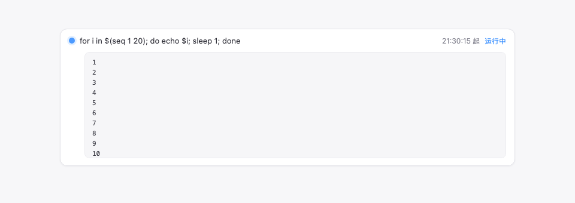

<h1 align="center">task-status</h1>

<p align="center">后台任务状态条：对话页输入区上方的任务进度 UI——运行中计数 + 展开详情 + 实时输出 tail</p>

<p align="center">
  
</p>

对话页输入框上方的后台任务状态条：运行中任务计数 + 点击展开逐条详情 + **实时输出 tail**（自动轮询，10 行滚动区）。经官方 `conversation.input.dock` 槽注册（与 queue/todo/goal 同族）。形态：官方 **bundle 插件**（`dsh.bundle` + dshClient 通道），0 patch。

## 效果



## 能力

**UI**（对话页 dock 槽）：

| 功能 | 说明 |
|---|---|
| 状态条 | 对话页输入框上方 dock 卡片：`⚙ N 个后台任务运行中` |
| 展开详情 | 点击任务行展开：状态/耗时/详情 + 输出 tail |
| 实时 tail | 展开时每 1s 轮询输出路由，整段替换渲染（镜像补丁保证与官方 `task_output` 工具零竞争、视图一致） |
| 滚动区 | 输出区 max 10 行（160px），超出变滚动条（tail 保尾可回看） |
| 仅对话页 | 非 Chat 视图（trajectory/taskboard 等）自动隐藏 |

**路由**（Node half）：

| 路由 | 说明 |
|---|---|
| `/plugins/dsh-task-status/tasks` | 任务列表（只读，按 session 过滤；owned + unowned 并集） |
| `/plugins/dsh-task-status/output` | 任务输出 tail（`full:true` 累积全文；未知 id 404） |

**输出 tail 的竞争语义**（0809 官方 API 约束）：`tasks.read` 是消耗式增量（每任务唯一共享游标）。本插件给 `ctx.tasks.read` 打**镜像补丁**——官方 read = 缓冲镜像（他人已读增量，不重复消耗）+ 直读补最新（正常消耗）；插件自读直接走底层 rawRead。官方工具与插件看到同一增量序列（无重复无丢失），仅主动自读部分官方不再能单独重放（官方语义本就是增量读取，模型感知无影响）。

## 安装

**推荐：git 源一行安装**（构建产物已入库，git 源不触发构建）：

```sh
dsh plugin --profile web add "github:dsh-external/dsh-task-status#main"
```

或本地目录（有源码时）：`git clone` 后 `cd dsh-task-status && dsh plugin --profile web add .`。

装完 **重启 web** 生效；设置页「插件」面板可停用/启用。

## 使用

跑一个后台任务即可看到状态条（如模型侧 `bash` 工具 `run_in_background: true`）：

```
⚙ 1 个后台任务运行中
  ● bash-1  for i in $(seq 1 20)…   21:30:15 起   运行中
```

点击任务行展开 → 输出 tail 实时滚动（超过 10 行滚动条）。任务结束后状态条自动消失。

## 开发

```sh
pnpm install
pnpm run build      # tsdown：Node half (lib/index.mjs) + client bundle (lib/client.js)
```

- Node half：`src/index.mjs`（镜像补丁 + `/tasks` `/output` 路由）
- client：`src/client/task-status.tsx`（dock 槽状态条）

## 许可

BSD-3-Clause（dsh-external 生态示例插件）。
